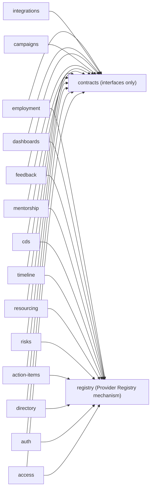
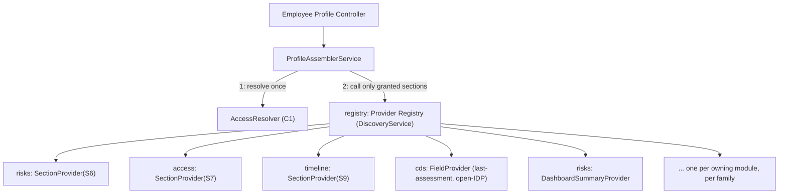
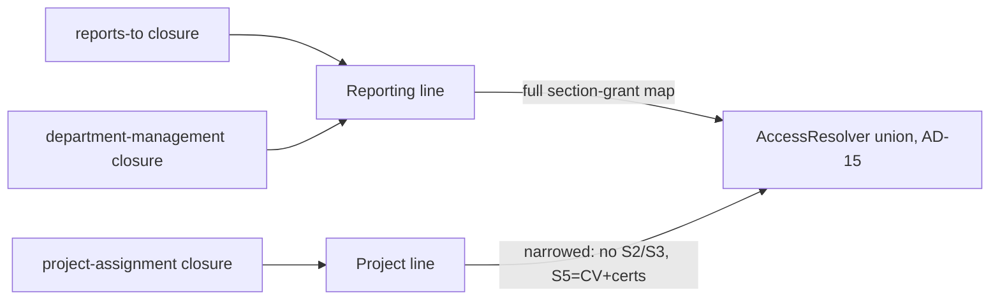
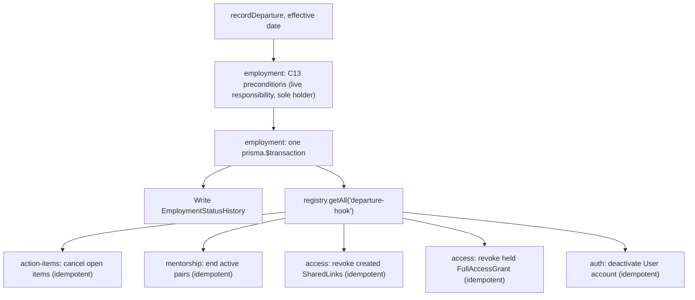
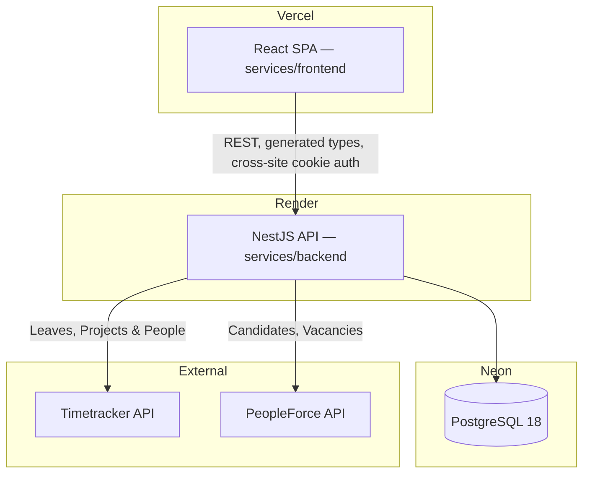

# Architecture Spine — People Management Platform

## Design Paradigm

**Layered modules with a centralized, DI-abstracted access-resolution layer.** Each backend feature is a NestJS module (controller → service → Prisma), matching the existing `modules/<name>` convention in `services/backend`. What makes this system's paradigm non-generic is the cross-cutting concern every layer must obey: no profile-scoped or aggregate data crosses a controller boundary without having passed through `AccessResolver` first. That resolution is architected as its own layer (the `access` module) that every other feature module depends on, and a generic Provider Registry mechanism (AD-3) makes cross-module reads possible — for profile assembly, directory filtering, and dashboard aggregation alike — without inverting AD-1's dependency direction.

Frontend mirrors the same idea one layer up: `EXPERIENCE.md`'s rule that an inaccessible section is absent from the DOM, not hidden, is enforced by never fetching or rendering data the backend didn't already filter — the frontend has no independent access logic to keep in sync.

**2026-08-26 update.** `project-requirements-v2.md` extends this same paradigm rather than replacing it: `access` grows two more responsibilities of the same shape it already has (resolving *who* can see *what*) — the Department hierarchy (AD-14) and a guarded, journaled path for writes that change access itself, not just data (AD-17) — and one genuinely new capability, CAP-14's departure lifecycle, reuses AD-3's registry mechanism for its own fan-out (AD-18) instead of inventing a second cross-module-call mechanism. No AD from the 2026-08-21 spine is reversed; several are tightened or extended in place, and AD-14 through AD-18 are net-new.

## Invariants & Rules

### AD-1 — Module dependency direction

- **Binds:** all backend modules
- **Prevents:** circular module dependencies; a feature module quietly depending on another feature module's internals instead of a stable contract; the rule eroding silently because nothing stops it compiling
- **Rule:** A feature module may depend only on `contracts` (interfaces/DTOs) and `registry` (the Provider Registry mechanism, AD-3). A feature module may **never** import another feature module directly — not through TypeScript imports, and not by querying another module's Prisma tables directly. Cross-module data needs are satisfied only through a `contracts`-declared interface, implemented by the owning module and consumed via `registry` or direct DI token. This is enforced in CI, not just by convention: a `dependency-cruiser` rule forbidding `modules/<a>/**` from importing `modules/<b>/**` (except `contracts`, `registry`) runs on every PR.



**2026-08-26 update — `employment` (AD-18, CAP-14).** Owns the departure lifecycle. Depends only on `contracts` + `registry`, same as every other feature module — no exception for the fact that it orchestrates a cross-module cascade; it calls the other modules only through the `departure-hook` registry family (AD-18), never by importing them. `actionitems`, `mentorship`, and `auth` gain a `registry` dependency here because each now *registers* a `departure-hook` provider (AD-18 — `auth` deactivates the departed `User` account, closing a gap the original 2026-08-26 draft of this spine missed entirely) — they previously had no reason to depend on `registry` at all. `resourcing` and `timeline` also gain (or rather, are *corrected* to show) a `registry` edge here: both already register providers per AD-3's own worked example and prose (`timeline`: `SectionProvider(S9)`; `resourcing`: dashboard `resourcing counts`) — this graph simply hadn't been kept in sync with AD-3 before this pass.

### AD-2 — Contracts module holds interfaces only

- **Binds:** `contracts`, and every module implementing C1–C13 or a registry provider
- **Prevents:** the contracts module becoming a dumping ground for shared logic (which would silently reintroduce feature-to-feature coupling through a back door); two implementers of the same contract diverging on a field the contract left unspecified
- **Rule:** `contracts` exports TypeScript abstract classes / injection tokens and DTO shapes only — zero business logic, zero Prisma imports. Each owning module (per `interface-contracts.md`'s ownership, extended below) provides the concrete implementation, bound to its token in its own module's providers array. A Wave-0/1 stub provider (fixed/permissive return) can be swapped in for any token before the real implementation lands, with zero change to consumers. Every DTO type crossing an HTTP boundary must be plain-JSON-serializable (`Record`/array/primitive) — a type usable only in-process (e.g. `Map`) must be converted at the module boundary before any controller returns it; this is the general form AD-10 also depends on.

| Contract | Signature (ratified shape) | Token owner (implements) | Consumers |
| --- | --- | --- | --- |
| C1 `AccessResolver` | `resolveAudience(viewerId, subjectId) → { role: Self \| ReportingLine \| ProjectLine \| PP \| Colleague \| SharedLink \| FullAccess, sections: Record<SectionId, "R"\|"RW"\|"none"> }` — `Record`, not `Map`, at any point this crosses an HTTP boundary (in-process composition may use a `Map` internally). **Role enum updated 2026-08-26:** `ManagerLine` splits into `ReportingLine` (reports-to ∪ department-management, AD-14) and `ProjectLine` (project-assignment alone, narrower); `HRAdmin` is removed — HR Admin is a functional role (C8) that grants no data access and must never appear as a resolved audience here; `FullAccess` replaces it as the terminal "sees everything" case, resolved only from the AD-17 grant, never from any functional role. Internally composes per-audience section grants as a **union**, never a ranked precedence (AD-15), and caps every section at `R` once the subject's employment status is `dismissed` (AD-18) | `access` | every module reading/writing profile-scoped data |
| C2 `FieldRegistry` | `defineField(...)`, `setValue(...)`, plus a uniform query interface over built-in/derived/custom fields. **Never** the write path for the manager/PP/department access-switch fields — those route only through C9 (AD-17) | `directory` | `directory`, `dashboards`, `campaigns` (audience filters) |
| C3 `ProjectAssignment` | `{ employeeId, projectId, pmId, dmId, startDate, endDate, confirmed: boolean, confirmedAt: DateTime }` — `confirmed`/`confirmedAt` are part of the ratified shape (AD-8 depends on both, not just `confirmed`). **Concrete numbers ratified 2026-08-26:** `confirmedAt` is stamped on the first successful sync that observes the row (never requiring sustained success); freshness/withdrawal numbers are AD-8's | `access` (seed), `integrations` (real writer) | `access` (Manager-access resolution), `resourcing` (candidate project context) |
| C4 `TimelineEventWriter` | `recordTimelineEvent(employeeId, type, effectiveDate, oldValue, newValue, source, authorId?)` — `oldValue`/`newValue` are always the **raw typed value** for `type` (e.g. the grade enum value, an ISO date, a boolean), never a pre-formatted string; the timeline UI formats per `type` at render time, mirroring AD-6's "only the registry branches on type" discipline. `markSystemWriteSkipped(manualEventId, skippedAt)` — attaches skip metadata to an **existing manual** `TimelineEvent` (per `EXPERIENCE.md`'s Career Timeline affordance); never creates a separate timeline row for the skip itself | `timeline` | `access`, `mentorship`, `integrations` |
| C5 `ExternalIdentityMapping` | `{ system, externalId, employeeId, supersededBy? }` | `integrations` | `integrations`, `resourcing` |
| C6 `ActionItemCreation` | `createActionItem({ assigneeId, authorId, title, description?, dueDate, link?, source, campaignId? }) → ActionItem` (rejects `source: 'campaign'` — use bulk path); `createCampaignActionItems({ campaignId, authorId, title, description?, dueDate, link?, assigneeIds }, tx?) → ActionItem[]` — atomic one-per-recipient batch for campaign activation | `action-items` | `campaigns` |
| C7 `CurrentUserProvider` *(new — closes a real gap: every controller needs the authenticated viewer's id, and AD-1 forbids importing `auth` directly)* | `getCurrentUser(request) → { userId }` — a request-scoped provider/decorator (`@CurrentUser()`), not a service method any module calls manually | `auth` | every controller that calls C1, directly or via `registry` |
| C8 `PermissionChecker` *(new — closes a real gap: functional-role/feature-permission checks, `access-model.md` §2.2–2.3, have no contract today)* | `hasPermission(userId, permissionKey) → boolean` | `access` | `resourcing`, `campaigns`, `cds`, `mentorship`, `directory` — anywhere a feature gate (not a data-visibility gate) is needed. No module queries `FunctionalRoleAssignment`/`FunctionalRolePermission` directly — mirrors AD-6's single-branch-point discipline. |
| C9 `OrgRelationshipWriter` *(new, 2026-08-26, AD-17 — signature reconciled with `interface-contracts.md` after the Reviewer Gate found the two documents disagreed)* | `changeManager(actorId, subjectId, newManagerId, expectedVersion) → JournalEntry`; `changePeoplePartner(actorId, subjectId, newPpId, expectedVersion) → JournalEntry`; `changeDepartment(actorId, subjectId, newDepartmentId, expectedVersion) → JournalEntry`; `changeDepartmentManager(actorId, departmentId, newManagerId, expectedVersion) → JournalEntry` (note: second param is `departmentId`, **not** `subjectId` — a department has no single subject employee); **added at the Reviewer Gate:** `createDepartment(actorId, name, parentId?) → Department`, `reparentDepartment(actorId, departmentId, newParentId, expectedVersion) → Department` — the "manage departments" permission's write path (`access-model.md`), closing the gap where `Department.parentId` had no guarded writer at all. This is the **only** legitimate write path for the four access-switch fields plus the `Department` tree itself; never reachable through C2's general field-edit path | `access` | frontend's dedicated relationship-change and department-admin screens; `employment` (CAP-14 re-parenting flow calls this directly rather than re-implementing the switch-write path) |
| C10 `RelationshipJournal` *(new, 2026-08-26, AD-17)* | `record(actorId, subjectId, kind, before, after) → JournalEntry`, `readFor(subjectId, readerId) → JournalEntry[]` — a narrow dedicated log, never the general audit log. `readFor`'s gate is **whoever currently holds Reporting-line, Project-line, or PP access** over `subjectId` (disambiguated at the Reviewer Gate — "current manager" was ambiguous after AD-14 split Manager into two tiers), plus Full-access holders | `access` | C9, the full-access grant/revoke flow, CAP-1's shared-link access path — never an ad hoc call site |
| C11 `EmploymentStatusService` *(new, 2026-08-26, AD-18)* | `recordDeparture(actorId, subjectId, effectiveDate, reason) → EmploymentStatusRecord`, `getCurrentStatus(employeeId) → "active"\|"dismissed"` | `employment` | `access` (C1's dismissed-caps-to-R rule), `directory`/`dashboards` (via the `field` registry family, never a direct query of `EmploymentStatusHistory`) |
| C12 `DepartmentDirectory` *(new, 2026-08-26, AD-14)* | `getDepartment(id) → { id, name, parentId, managerId }`, `getAncestorIds(departmentId) → id[]`, `getDescendantIds(departmentId) → id[]`, `getManagedDepartmentIds(employeeId) → id[]` (**every** `Department` row naming this person as `managerId`, plus every descendant of each — `managerId` has no uniqueness constraint, so the same person can be `managerId` on more than one row; the array reflects both that case and the "one direct assignment, many nested descendants" case, resolved live — never pinned) | `access` | `directory` (column/filter), `cds` (matrix dictionary), `resourcing` (live UM routing, D18), `dashboards` (grouping) |
| C13 `AccessControlStateReader` *(new, added at the Reviewer Gate — closes a real gap: two 2026-08-26 requirements needed a cross-module read of `access`'s own grant state that no contract exposed)* | `hasLiveResponsibility(employeeId) → boolean` (true if `employeeId` is currently `managerId`/`ppId` for anyone, or `Department.managerId` for any department) — the precondition C11's `recordDeparture` (AD-18) must check before allowing a departure; `getFullAccessHolderIds() → employeeId[]` — backs both AD-18's "is this the sole remaining holder" departure block and D18's "reassign to a Full-access holder as backstop" routing | `access` | `employment` (AD-18 preconditions), `resourcing` (D18 departed-DM/UM reassignment backstop) |

### AD-3 — Provider Registry (cross-module reads without cross-module imports)

- **Binds:** CAP-1 (profile assembly), CAP-2 (Directory's derived/filterable fields, FR-34), CAP-12 (Dashboards, FR-47–51), CAP-14 (the `employment_status` filterable field, FR-64), and every module that owns data one of those needs to read
- **Prevents:** `access`/`directory`/`dashboards` needing a direct import of every other feature module (which AD-1 forbids); a data-owning module forgetting to gate its own data behind `AccessResolver`; ambiguity over what a missing or colliding registration does at runtime
- **Mechanism:** NestJS has no built-in multi-provider merge across modules (this is not Angular). The registry is a small `registry` module using `@nestjs/core`'s `DiscoveryService` + `Reflector`: any injectable class decorated `@RegisterProvider(family, id)` is discovered at application bootstrap and indexed by `(family, id)`. `registry` depends only on `@nestjs/core` — never on any feature module — so any feature module may safely depend on `registry` without violating AD-1. **Two distinct lookup shapes share this one mechanism, added explicitly at the 2026-08-26 Reviewer Gate to close an ambiguity:** `section`/`field`/`dashboard-summary` are **single-key lookups** — a caller already knows the specific `id` it wants (e.g. `getSection(S6)` looks up exactly `(section, S6)`), and a second registration under the same `(family, id)` is the bootstrap-time collision failure below. `departure-hook` (AD-18) is instead an **enumeration** — `registry.getAll("departure-hook"): DepartureHook[]` returns **every** provider registered under that family regardless of `id`, and multiple registrants under the same family are the expected, required shape, not a collision (each still registers under its own unique `id`, e.g. `"shared-link-revoke"`, purely so registration itself stays de-duplicated — nothing ever looks one up by that `id`). `employment` calls `getAll`, never a family+id pair, so it never needs to know the specific hook `id`s or which modules registered them.
- **Rule:**
  - Three read-side provider families, one shared mechanism: `SectionProvider.getSection(viewerId, employeeId): SectionDto` (profile assembly, one per S1–S16-owning module), `FieldProvider.getFilterableFields(): FieldSpec[]` + resolver (Directory's CDS-derived filters, e.g. FR-34's last-assessment-date/open-IDP, and — 2026-08-26 — `employment`'s `employment_status` field, C11), `DashboardSummaryProvider.getSummary(viewerScope): SummaryDto` (Dashboards' per-source aggregates: risk counts, leave status, resourcing counts, active/dismissed counts). `risks`' `SectionDto`/`SummaryDto` both include a precomputed `trend: "up" | "down" | "flat"` field — diffed against the previous `RiskRecord` once, backend-side — so Profile, All Employees, and Risk Dashboard render the identical value instead of three independent frontend implementations of the same diff (per `DESIGN.md`'s Trend Arrow).
  - `null` is reserved for "not authorized / not applicable" — a state `ProfileAssemblerService` should never actually observe, since AD-5 means it only calls a provider for a section already granted. "Authorized, no records yet" is **always** a present, empty-shaped DTO, never `null`.
  - Registration collision (two providers for the same `(family, id)`) is a **bootstrap-time failure**, not a silent last-wins/first-wins. A section/field/summary that should have a provider but doesn't is a **runtime error at first call**, rendered to the frontend as an explicit "temporarily unavailable" state — never a silent omission indistinguishable from "not granted" (a genuine data-leak-shaped bug per `access-model.md` Rule 1's own framing).
  - `ProfileAssemblerService` (in `access`) resolves the viewer's audience **once** per request via C1, then calls `SectionProvider.getSection` **only** for sections the resolved role grants.



### AD-4 — Access resolution is per-request; caching is generation-gated or absent

- **Binds:** CAP-1, all `AccessResolver` consumers
- **Prevents:** a stale permission cache becoming a data leak (SPEC constraint, `decisions.md` D1)
- **Rule:** `AccessResolver.resolveAudience()` is called fresh on every request by default — no caching in v1. If profiling under NFR.2 (500+ records, 2s target) shows this is a bottleneck, the **only** acceptable cache shape is D1's: a per-subject cache invalidated synchronously by a monotonically increasing generation counter across **four** relationship graphs — reports-to, project assignment, PP assignment, and (**added 2026-08-26, AD-14**) department management. The counter must bump on **any** write to a `ProjectAssignment` row — including a `confirmed`/`confirmedAt` flip on an existing row (AD-8), not only row create/delete — and on any C9 org-relationship write (AD-17) or C11 status change (AD-18) — so a future cache can never race AD-8's outage-handling, AD-17's relationship writes, or AD-18's departure cascade. This AD does not implement the cache — it forbids implementing any *other* kind, and pins this specific gap shut in advance.

### AD-5 — Colleague whitelist is a resolved role, not a filter

- **Binds:** CAP-1, CAP-2 (Colleague mode of the directory), CAP-10 (campaign-sender exception)
- **Prevents:** a developer implementing "Colleague" by taking the full profile response and stripping fields client-side or in a post-processing step
- **Rule:** `AccessResolver` resolves Colleague to a **fixed section-grant map** — S1, S10 (**2026-08-26: dates only, leave type withheld** — reversed from the original whitelist, which included type), S11 (project name only) — identical to any other resolved role — `ProfileAssemblerService` (AD-3) never sees a code path that says "assemble everything, then trim." The whitelist is data the resolver returns, not logic the frontend or a serializer applies. The same discipline governs Shared Link creation: S3/S7/S13 are **structurally excluded** server-side (the `access` module's link-creation validation rejects them outright, regardless of what a client submits) — never merely omitted from a frontend checkbox list, which would be exactly the client-side-only filtering this AD forbids. **Campaign-sender exception, added 2026-08-26 (`access-model.md` Rule 7):** the one sanctioned widening of the Colleague grant — a campaign's creator additionally sees, for that campaign only, each recipient's name plus that campaign's own `ActionItem` status, resolved the same structural way (a scoped grant `AccessResolver` computes and returns, keyed by `campaignId`, never a frontend-side "also show this if I sent it" branch) and withdrawn the instant the campaign closes. No other feature may widen Colleague without a new `AccessResolver`-level grant of this same shape.

### AD-6 — Custom fields: typed-value table, not column-per-field

- **Binds:** CAP-2 (`FieldRegistry`, C2)
- **Prevents:** a schema migration on every HR-Admin-created field (SPEC constraint, PRD FR-8); two developers disagreeing on what an unset value or a missing row means
- **Rule:** One `CustomFieldValue` table: `(employeeId, fieldDefinitionId, valueText, valueNumber, valueDate, valueBoolean, valueSelect)` — one column populated per row, typed by `CustomFieldDefinition.type`; every unused column is SQL `NULL`, **never** a typed sentinel (`''`, `0`, `false`). A `CustomFieldValue` row exists **only** once a value is actually set (lazy creation) — a missing row, not a present all-`NULL` row, is the sole representation of "unset." Filtering/sorting queries branch on `CustomFieldDefinition.type` to pick the populated column; a partial index per commonly-filtered field is a query-time optimization, not a schema change. `FieldRegistry`'s query interface (C2) is the **only** place that branches on field type — no consumer (directory, dashboards, campaigns) special-cases custom vs. built-in fields.

### AD-7 — Temporal fields are effective-dated history tables

- **Binds:** CAP-1 (S4 Employment), CAP-7 (Career Timeline), CAP-14 (`EmploymentStatusHistory`), PRD §1 Process and Data Guardrails
- **Prevents:** grade/position/department/employment-type/employment-status modeled as a scalar column plus a bolted-on audit log (PRD constraint, explicit); a history-table write landing without its paired timeline event (or vice versa); a departure incorrectly surfacing as a timeline event
- **Rule:** One history table per dimension — `GradeHistory`, `PositionHistory`, `DepartmentHistory`, `EmploymentTypeHistory`, and — **2026-08-26** — `EmploymentStatusHistory` — each `(employeeId, value, effectiveFrom, effectiveTo)`, `effectiveTo IS NULL` = current. `DepartmentHistory.value` is now a foreign key to the new `Department` entity (AD-14), not a free-text/enum value — the same effective-dated shape, a typed reference instead of a scalar. The current-value read is `WHERE effectiveTo IS NULL`, never a denormalized "current" column that could drift from the history. The coupling to `TimelineEventWriter` (C4) is structural, not a convention to remember: a Prisma Client Extension (`$extends`) on **`GradeHistory`, `PositionHistory`, `DepartmentHistory`, `EmploymentTypeHistory`** operations calls C4 automatically — no service method writes to one of these four tables through any other path. When that extension detects the incoming system-sourced write would overwrite a manual `TimelineEvent` covering the same effective window (`decisions.md` D2), it suppresses the history write and calls C4's `markSystemWriteSkipped(manualEventId, skippedAt)` to attach skip metadata to the **existing manual entry** — never a silent no-op, and never a separate timeline row; `EXPERIENCE.md`'s "A system update was skipped here — {date}" affordance renders on that manual entry by querying the annotation C4 wrote. **`EmploymentStatusHistory` is explicitly excluded from this Prisma Client Extension** — CAP-14 requires that leaving the company is never a timeline event (`SPEC.md` CAP-7), so `employment` writes `EmploymentStatusHistory` through its own path (C11), never through the four-table extension; a developer wiring a fifth table into the extension by pattern-matching the other four is exactly the divergence this carve-out forbids.

Manager and PP are **not** in this table set — the SPEC's temporal-field constraint names grade/position/department/employment-type/employment-status only. Those two access-switch fields (AD-14, AD-17) stay current-value foreign keys on `Employee`, with their change history living solely in the `RelationshipJournal` (C10) — a narrower, purpose-built audit trail rather than a second effective-dated table nobody reads for a "current value" query.

### AD-8 — Timetracker confidence state gates access, never display alone

- **Binds:** CAP-13, CAP-1 (`ProjectAssignment`, C3)
- **Prevents:** a sync outage silently granting stale Manager access (`decisions.md` D3, PRD FR-53/FR-58), including the case where a person rolls off a project *during* a prolonged outage; a resettable outage clock letting a flapping sync accumulate unbounded staleness (`decisions.md` D19)
- **Rule:** `ProjectAssignment` rows carry `confirmed: boolean` **and** `confirmedAt: DateTime` (both part of C3's ratified shape, AD-2), written by `integrations` on every successful sync pass — not just on first creation. `AccessResolver`'s project-assignment leg grants Manager access only from rows where `confirmed = true` **and** `confirmedAt` is within a bounded freshness window. **Concrete numbers ratified 2026-08-26 (`decisions.md` D3/D19, superseding the original "sync interval × 2" placeholder):** `confirmedAt` is stamped on the **first** successful sync that observes the row (never requiring sustained success, so a flapping sync can still confirm a genuinely new assignment within the stated 15-minute latency bound), and the freshness window that ages a row out is **4 hours of cumulative failed sync time within a rolling window** — not a continuous-failure streak reset by a brief recovery. This closes the sticky-flag gap: a row that was confirmed before an outage began ages out during a prolonged *or flapping* outage and stops granting access, rather than granting it indefinitely on stale-but-once-true data, and never resets its accumulated staleness just because the sync briefly recovered. Display-layer "temporarily unavailable" (S10/S11) is a **separate**, frontend-visible sync-freshness flag — implementing one must never touch the other's code path.

### AD-9 — Auth is a distinct concern from access-role resolution

- **Binds:** `auth`, `access`
- **Prevents:** authentication logic and access-role logic becoming entangled, which would make a future SSO swap touch the access model
- **Rule:** `auth` answers only "who is this session" (JWT, local email/password) and produces a `userId`, exposed to every other module exclusively through C7 `CurrentUserProvider` (AD-2) — never through a direct import of `auth`'s guards/services. `access` (`AccessResolver`, C1) answers "what can this `userId` see about subject X" from relationship data alone. `auth` has zero knowledge of sections, roles, or the access matrix; `access` has zero knowledge of how the session was established.

### AD-10 — API contract is generated, not hand-written, on the frontend

- **Binds:** frontend `api/` layer, all backend controllers
- **Prevents:** frontend/backend type drift; a frontend track blocked on a backend endpoint actually existing before building against its shape
- **Rule:** Every backend controller carries complete `@nestjs/swagger` decorators (already the established pattern, see `modules/users`), and every response DTO is already HTTP-safe per AD-2's serializability rule. Frontend types are generated from `/api/docs-json` via `openapi-typescript` into a committed, regenerable file — never hand-authored parallel interfaces. CI regenerates the file and diffs against the committed version, failing the build on drift. A track can freeze a controller's DTO shape and decorators in Wave 0/1 and generate against it before the service logic is real.

### AD-11 — Frontend surfaces map 1:1 to EXPERIENCE.md's IA, not to backend modules

- **Binds:** frontend `pages/`
- **Prevents:** the frontend's page structure drifting from the UX spine's information architecture, or being reorganized around backend module boundaries instead; backend modules acquiring unratified peer-to-peer calls in place of frontend orchestration
- **Rule:** One `pages/<Surface>/` folder per `EXPERIENCE.md` IA row (Dashboard, AllEmployees, EmployeeProfile, MyProfile, Resourcing, RiskDashboard, Campaigns, MentorshipHub, AdminRoles, AdminFields; SharedLinkView as an authenticated route — per `EXPERIENCE.md`'s Foundation, Shared Link consumption still requires a session, additionally scoped by validating the link token server-side against `SharedLink`/`SharedLinkSection` — reached via direct URL rather than nav, not a public unauthenticated shell). A page folder may call several backend modules' generated API hooks — the frontend's organizing axis is the user-facing surface, the backend's is the domain. Where a PRD flow spans two capabilities with no contract between their owning modules (e.g. FR-46's "request feedback" creating a Form Campaign; CAP-6's candidate review triggering a Shared Link), the frontend orchestrates the two calls in sequence from the initiating page — `feedback` and `resourcing` never call `campaigns`/`access` directly, and `campaigns`/`access` never call back into the initiator.
- **2026-08-26 gap, see Deferred:** `project-requirements-v2.md` adds three admin surfaces (the organisational-relationship change screen, C9/AD-17; full-access grant management, AD-17; departure recording, C11/AD-18) that `EXPERIENCE.md` does not yet enumerate as IA rows — this AD cannot ratify a 1:1 mapping for them until the UX spine is updated. Build against the C9/C10/C11 contracts in the meantime; don't invent page names ahead of that pass.

### AD-12 — Deployment & environments

- **Binds:** all modules, operational envelope
- **Prevents:** "deployed and demonstrable, not on someone's laptop" (PRD success signal) being left to each developer's own ad hoc setup
- **Rule:** Single containerized deployment — `docker-compose` (already used locally for Postgres) extended to three services: `backend`, `frontend` (built static assets served by a lightweight server, or Vite preview), `postgres`, on one host or a simple container platform. One environment (`production`) for this iteration; no staging tier. Secrets (`DATABASE_URL`, `JWT_SECRET`, `TIMETRACKER_API_KEY`, `PEOPLEFORCE_API_KEY`) via environment variables, validated by the existing Joi schema, never committed.
- **2026-09-01 supersession:** the docker-compose rule above was never itself a PRD requirement — only "deployed and demonstrable, not on a laptop" is (checked directly against `project-requirements-v2.md`; Story 1.17's original **FRs: NFR-7** citation was a miscite, NFR-7 is repo/doc currency, unrelated to deployment mechanism). Replaced with a managed-PaaS topology, still one environment / no staging tier: `frontend` on **Vercel** (auto-deploy on push to `Unsloppers-FE`'s `main`), `backend` on **Render** (auto-deploy on push to `Unsloppers-BE`'s `main`), Postgres on **Neon** (managed). Secrets set per-platform via each dashboard's environment variables, still validated by the existing Joi schema, still never committed. Splitting FE/BE across two registrable domains has two concrete consequences the code had to account for, not just ops config: the session cookie is `SameSite=None; Secure` rather than `Strict` in production (a `Strict`/`Lax` cookie is silently dropped on cross-site requests), and CORS must echo the exact FE origin with `credentials: true`. Full setup, env var list, and known limitations: `docs/deployment.md`.

### AD-13 — Test architecture

- **Binds:** all modules; directly implements SPEC's primary success metric (SM-1) and PRD §1's foundation-phase requirement
- **Prevents:** the access-matrix test suite (SM-1's whole substance) being built ad hoc per developer, per module, with inconsistent coverage
- **Rule:** Jest, matching the existing convention (`src/modules/*/__tests__/`, `test/` for e2e — both already established). Every `SectionProvider`/`FieldProvider`/`DashboardSummaryProvider` implementation ships a parameterized access-matrix test (see Consistency Conventions) as part of its own module's `__tests__/`, not a separate cross-cutting test module — the test lives next to the code it verifies, same discipline as the rest of the codebase. `AccessResolver` itself (in `access`) carries the master parameterized suite driven directly off `access-model.md`'s table. e2e tests (Playwright, existing frontend convention) cover full request/response cycles for the negative cases explicitly required by PRD §9's Definition of Done — every `—` cell, every flag-gated record against both gated audiences, the Colleague whitelist.

## 2026-08-26 additions — `project-requirements-v2.md`

`project-requirements-v2.md` and the resulting SPEC/access-model/decisions/interface-contracts update extend the 2026-08-21 spine rather than replacing it. AD-1 through AD-13 above are amended in place where noted; AD-14 through AD-18 below are net-new, closing five gaps a builder relying only on the original 13 could not have anticipated: a second manager tier, a resolved-role composition rule, a shared link's exposure lifetime, a class of write more privileged than any section grant, and a cross-module cascade with no precedent in the original registry.

### AD-14 — Department hierarchy is a third relation, owned by `access`, resolving two manager tiers

- **Binds:** CAP-1 (Reporting line vs. Project line), CAP-2 (department column/filter), CAP-6 (live UM routing, D18), CAP-8 (matrix dictionary keyed off department), CAP-12 (department grouping)
- **Prevents:** a builder treating "Manager" as one relation when it is now three (reports-to, department-management, project-assignment) unioned into two *differently-scoped* grants; `directory`/`cds`/`resourcing`/`dashboards` each inventing their own department-hierarchy read (or worse, their own copy of the parent/child tree) instead of sharing one; a project-line grant silently leaking S2/S3/full-S5 because a developer treated "Manager" as a single undifferentiated grant
- **Rule:** `Department` (`id`, `name`, `parentId` self-referential, `managerId → Employee`, no uniqueness constraint on `managerId` — the same person may be named manager of more than one `Department` row) is a new entity, owned by `access` — the same module that already owns `FunctionalRole`/`FunctionalRolePermission` despite HR Admin administering them, because department membership and department management are access-control data first and administered dictionary data second. Exposed to every other module exclusively via **C12 `DepartmentDirectory`** (AD-2) — no module queries the `Department` table directly (AD-1). `AccessResolver`'s Manager leg becomes the union of **two tiers**, never one: the **Reporting line** (reports-to closure ∪ department-management closure, both transitive) gets the **full** Manager section-grant map, identical to the pre-2026-08-26 spine's single tier; the **Project line** (project-assignment closure alone) gets a **strictly narrower** map — no S2, no S3, S5 limited to CV+certificates (`access-model.md` Rule 2). A `SectionProvider` (AD-3) must never re-derive "Manager" as one audience or re-run any closure walk itself — it receives the resolved tier (`ReportingLine` or `ProjectLine`) from C1 and returns the section content for whichever grant level that tier holds; the narrowing lives entirely in `AccessResolver`, never duplicated in a provider. **One documented exception, found at the 2026-08-26 Reviewer Gate:** S7 is **not** uniform across the Project line (`access-model.md` Rule 3 gives a Project-line DM unconditional `RW`, a Project-line PM only `R` gated by the *visible-for-PM* flag) — `AccessResolver` resolves this from the same `ProjectAssignment` row (C3) it already used to grant Project-line access, since C3 already carries `pmId`/`dmId` separately; this stays inside `access` (which owns both C1 and S7's own `SectionProvider`), so it never crosses AD-1's module boundary and never needs a third externally-visible tier in C1's `role` enum — S7's provider is the one place permitted to read the `pmId`/`dmId` split beneath the `ProjectLine` label, every other `SectionProvider` still receives only the flat tier. `DepartmentHistory` (AD-7) records which `Department` an employee belongs to over time; `Department.managerId`, `parentId`, and `name` are current-value only, changed exclusively through C9 (AD-17), which now also covers `Department` creation and re-parenting (with the same no-cycle guard AD-17 already applies to the employee reporting chain).



### AD-15 — Multi-audience section access is a union, never a ranked precedence

- **Binds:** CAP-1, every `SectionProvider`/`AccessResolver` consumer
- **Prevents:** a developer resolving "the viewer's audience" as a single winning role (e.g. "PP beats Project line") when the same viewer can hold two audiences over the same subject simultaneously — a bug that passes every single-audience test and only surfaces on the untested overlap case (`decisions.md` D13)
- **Rule:** `AccessResolver.resolveAudience()` computes the **full set** of audiences the viewer holds w.r.t. the subject (any of Self/ReportingLine/ProjectLine/PP/Colleague/SharedLink — never more than one of Self, and SharedLink only in the link-view code path), resolves each audience's section-grant map independently, then combines them **per section** by taking the least-restrictive value across the set (`none < R < RW`). This combination step is a pure function over already-resolved maps — it must never be reimplemented by ranking audiences and picking one, because that silently drops whichever audience the ranking placed second. The externally-visible `role` field in C1's return shape (AD-2) is the union's provenance for display/logging only (e.g. "PP + Project line") — it is never itself branched on to decide section access.

### AD-16 — Shared link exposure re-clamps continuously to the creator's live access, not just at creation

- **Binds:** CAP-1 (Profile Sharing, C1)
- **Prevents:** a shared link's exposed sections being computed once at creation and left stale as the creator's own access changes (`decisions.md` D14); a link with no living rights-holder able to revoke it
- **Rule:** A `SharedLink`'s `cfg`-enabled sections are stored as the creator's *intent* at creation, but every **view** of the link re-resolves `AccessResolver.resolveAudience(creatorId, subjectId)` fresh and re-clamps the rendered sections to the creator's **currently held** access for each — never a one-time snapshot, and never merely checking whether the creator/subject relationship still exists at all. If the creator's tier narrows (e.g. Reporting line → Project line, or the relationship ends outright), the next view renders exactly what the narrower access now permits, with no separate revoke step required to make that happen. Revocation rights and C10 journal-read rights for a link follow **whoever currently holds Reporting-line, Project-line, or PP access** over the subject (disambiguated at the 2026-08-26 Reviewer Gate — "Manager" alone became ambiguous the moment AD-14 split it into two differently-scoped tiers; revocation is a shut-off action, not a data read, so the more permissive union of both tiers is deliberately used here rather than Reporting-line only) — resolved live via C1 at request time, never the link's original creator field — with a Full-access holder as the backstop via **C13**'s `getFullAccessHolderIds()` (AD-2), so a link is never left with nobody able to revoke it.

### AD-17 — Access-control-state writes are a third gated axis, distinct from section access and feature permissions

- **Binds:** CAP-1 (organisational relationships, full profile access), CAP-2/CAP-8 (department dictionary, via "manage departments"), `access`
- **Prevents:** the four access-switch fields (manager, PP, department, department-manager), the `Department` tree itself, or the full-access grant being written through the general profile-edit path (C2) that backs S1's `RW` grant — which would make "who can see everything" or "who reports to whom" editable by anyone with ordinary write access to a profile; a self-grant; a reporting cycle in the employee chain *or* the department tree; a lost concurrent write; an orphaned department; a full-access holder count racing to zero
- **Rule:** **C9 `OrgRelationshipWriter`** is the only legitimate write path for manager/PP/department/department-manager, **and** — added at the 2026-08-26 Reviewer Gate, closing a gap where `Department.parentId` had no guarded writer at all — for `Department` creation and re-parenting via its `createDepartment`/`reparentDepartment` methods (AD-2). Every call: (1) checks C8 `PermissionChecker` for `change_organisational_relationships` (employee-field methods) or `manage_departments` (department-tree methods), (2) rejects self-assignment outright regardless of held permissions, (3) rejects a `changeDepartmentManager` whose new manager is a current member of that department or any nested sub-department (no self-managed department — closes a backdoor to self-granted Reporting-line access), (4) rejects a `changeManager` whose new manager is already a descendant of the subject in the reporting chain, **and symmetrically rejects a `reparentDepartment` whose new parent is already a descendant of that department** (no cycles in either graph AD-14's transitive-closure walks depend on — the employee reporting chain, or the department tree C12's `getAncestorIds`/`getDescendantIds` walk), (5) takes an expected-version precondition and rejects a stale write with a conflict error rather than silently applying it, (6) rejects a `changeDepartmentManager` clear unless a replacement is designated in the same call (no orphaned department), and (7) calls **C10 `RelationshipJournal`** to record the change (department-tree writes included). The **Full Profile Access** grant/revoke flow is a distinct mechanism with the same shape of risk: non-self-assignable, seeded at deployment, and its holder count is re-checked **at commit time** inside the same transaction as the revoke — never from an earlier read — so two holders revoking each other simultaneously can never race the count to zero; every grant/revoke also calls C10, and **C13**'s `getFullAccessHolderIds()` is the sanctioned read of current holders for every consumer that needs it (AD-18, `resourcing`'s D18 backstop routing) — never a direct query of the grant table. Neither write path is reachable from C2, from a controller's generic `PATCH /employees/:id`, or from any other write surface — a `dependency-cruiser`-style or code-review check that greps for direct writes to `Employee.managerId`/`ppId`/`departmentId` or `Department.managerId`/`parentId`/`name` outside `access`'s C9 implementation is the enforcement mechanism, mirroring AD-1's CI-enforced boundary.

### AD-18 — Employment status gates access to read-only; the departure cascade is one atomic, idempotent transaction fanned out via the registry

- **Binds:** CAP-14 (new), CAP-1 (access revocation, `auth` account deactivation), CAP-4 (action-item auto-cancel), CAP-9 (mentorship auto-close), `employment` (new module)
- **Prevents:** a departure cascade left as a "please remember to also..." checklist across modules; a lingering background job where the SPEC requires atomic and immediate; a double-cancel/double-close when two triggers race (two overlapping departures, or a manual action colliding with the cascade) (`decisions.md` D16/D17); FR-63's account-deactivation clause silently having no owner (a gap the Reviewer Gate found in this AD's own first draft — see the corrected registrant list below)
- **Rule:** A new module, `employment`, owns **C11 `EmploymentStatusService`** and `EmploymentStatusHistory` (AD-7's fifth temporal dimension, explicitly carved out of AD-7's timeline-coupling Prisma extension — a departure is never a `TimelineEvent`). `recordDeparture` first blocks (structured error) if **C13**'s `hasLiveResponsibility(subjectId)` is true (the subject still holds live Reporting-line/PP responsibility over anyone), or if `subjectId` appears in **C13**'s `getFullAccessHolderIds()` and that list has length 1 (the sole remaining Full-access holder, AD-17) — both require re-parenting/re-granting first, via C9, before the departure can be recorded; `employment` reaches these checks only through C13's direct DI token (AD-2), never by importing `access` or querying its tables (AD-1). On the effective date, the cascade runs inside one `prisma.$transaction`: `employment` writes `EmploymentStatusHistory`, then calls `registry.getAll("departure-hook")` — the **enumerating** lookup AD-3 now specifies for this family, distinct from the other three families' single-key lookup — and invokes every returned hook. **Five** registrants close every FR-63 clause, corrected at the 2026-08-26 Reviewer Gate from an initial draft of this AD that named only four and silently dropped account deactivation: `action-items` cancels open items as `"cancelled — departed"`; `mentorship` ends active pairs with a system-generated closure note bypassing the mandatory-note gate; `access` explicitly revokes every `SharedLink` the subject created and any `FullAccessGrant` they held (never left as an implicit side-effect of AD-16's re-clamp); **`auth` deactivates the subject's `User` account** (the omission the Gate caught — `auth` is why AD-1's graph now carries an `auth --> registry` edge it didn't have before this pass). The orchestrator passes the **same transaction client** into each hook, so the whole cascade commits or rolls back as one unit; no hook opens its own top-level query. Every hook is individually **idempotent** — a no-op against an already-cancelled item, an already-ended pair, or an already-deactivated account — since two overlapping departures (both members of a mentorship pair departing on the same day) or a concurrent manual action can trigger the same hook twice. `AccessResolver` (C1) additionally caps every section's grant at `R` once C11's `getCurrentStatus` returns `dismissed` for the subject, regardless of what tier the viewer would otherwise resolve to — this is checked once, in C1, so no consumer needs its own dismissed-employee special case. `directory`'s default list and every dashboard counter read C11 (via the `field`/`dashboard-summary` registry families, never a direct `EmploymentStatusHistory` query) as the single source of "has this person left" — never their own derived definition, and never conflated with `risks`' unrelated `leaver` prediction.



## Consistency Conventions

| Concern | Convention |
| --- | --- |
| Naming (entities, files, interfaces) | Backend: `modules/<kebab-name>`, one Nest module per row in AD-2's table; Prisma models PascalCase singular (`Employee`, `RiskRecord`), mapped to snake_case tables via `@@map` (existing convention, e.g. `User` → `@@map("users")`). DTOs suffixed `Dto`. Frontend: `pages/<PascalCaseSurface>/`, component folders per existing `react-components.md` rule. |
| Data & formats (ids, dates, error shapes) | IDs: UUID (matches existing `User.id`). Dates: ISO 8601 over the wire, `DateTime` in Postgres. Errors: Nest's built-in `HttpException` hierarchy + a global exception filter producing one JSON envelope `{ statusCode, message, error }` — no module invents its own error shape. |
| State & cross-cutting | Controllers never call Prisma directly — always through the module's service. **Two separate axes** (`access-model.md` §2.2–2.3): C1 `AccessResolver` gates **section visibility** during profile assembly (`ProfileAssemblerService`), directory filtering, and any read path that must obey the section matrix (AD-3/AD-4/AD-5/AD-8/AD-15/AD-16). C8 `PermissionChecker` gates **functional features** (resourcing, campaigns, CDS maintenance, mentorship assignment, custom-field admin) — never conflated with section visibility and never invoked from `ProfileAssemblerService` or the `registry` layer. **A third axis, added 2026-08-26:** C9 `OrgRelationshipWriter` (AD-17) gates **access-control-state writes** (manager/PP/department/department-manager, full-access grant/revoke) — a section's `RW` grant from C1, and a feature permission from C8, are both necessary but neither is sufficient for these four fields; only C9's own guarded path may write them. None of the three axes is re-implemented per module. Config via `@nestjs/config` + Joi (existing pattern), including `TIMETRACKER_API_KEY`/`PEOPLEFORCE_API_KEY` and the sync-freshness-window value (AD-8: 15 minutes / 4 cumulative hours by default). Structured logging via Nest's built-in `Logger`, one logger per service class. |
| Frontend server state | TanStack Query exclusively for server data (existing pattern) — no duplicate client-side cache of the same data in Context/Zustand. `LayoutContext` (existing) remains the only cross-cutting **UI** state; no new global state library introduced. |
| Frontend copy | `react-i18next` (existing pattern) — every new string is a translation key, never hardcoded, matching `EXPERIENCE.md`'s Foundation and the existing `CLAUDE.md` code-style rule. |
| Non-production data | Seed/dev/test data is generated pseudonymized (real structure/volume, substituted names/contacts) by a dedicated seed script (`prisma/seed.ts`, SPEC NFR.3) — never a dump or copy of production data. Enforced by having no tooling path that reads production Postgres from a non-production environment (AD-12 — single deploy target today, so this is a config/access-control discipline, not a network-topology one yet). **2026-08-26:** the seeded population (SPEC §4.17) *is* this non-production data — there is no separate "real" population to accidentally leak in, since employee provisioning is explicitly out of scope. |
| Access-matrix test convention | One parameterized test suite per section (S1–S16), iterating every audience row of `access-model.md`'s matrix as a table-driven case — asserting the exact `R`/`RW`/`none` outcome per (audience, section) pair, plus an explicit negative case for every `—` cell **and every narrowed Project-line cell** (AD-14). Generated/maintained alongside `access-model.md` so the two never drift; this is what SM-1 (the SPEC's primary success metric) is actually built against, not an afterthought layered on at QA time. **2026-08-26 additions:** a dedicated multi-audience overlap suite asserting union, not precedence (AD-15); a shared-link suite asserting the exposed-section set shrinks on the very next view once the creator's access narrows (AD-16); a campaign-sender suite asserting exactly name + that campaign's item status leaks and nothing else (AD-5). |

## Stack

| Name | Version |
| --- | --- |
| NestJS | 11 (existing) |
| Prisma | 7, `@prisma/adapter-pg` (existing) |
| PostgreSQL | 18 (existing, docker-compose) |
| Node.js | 22 (existing — project's own `engines` constraint; Prisma 7's own floor is 18.18, 22 is this project's pin, not Prisma's requirement) |
| React | 19 (existing) |
| Vite | 8 (existing) |
| shadcn/ui (`style: radix-nova`, per the repo's own `components.json`) + Tailwind | v4 (existing) |
| React Router | v7 (existing) |
| TanStack Query | v5 (existing) |
| openapi-typescript | 7.13.0 — new, for AD-10 |
| @nestjs/jwt | 11.0.2 — new, for AD-9 |
| @nestjs/passport | 11.0.5 — new, for AD-9 |
| passport-jwt | 4.0.1 — new, for AD-9. Flagged maintenance-inactive upstream (~4 years since last publish) but still the correct pin (nothing newer exists) and widely depended-on; accepted as a low-churn, stable dependency for a JWT-verification strategy, not a currency risk. Revisit only if a concrete vulnerability surfaces. |
| react-hook-form | 7.85.0 — new, noted as not-yet-installed in frontend `CLAUDE.md`, needed for the first form surface (resourcing request, custom field definition, campaign creation) |
| zod | 4.4.3 — new, paired with react-hook-form |
| @hookform/resolvers | 5.9.1 — new, bridges react-hook-form + zod |
| dependency-cruiser | latest — new, for AD-1's CI-enforced module-boundary rule |

## Structural Seed



Deployment topology per AD-12's 2026-09-01 supersession: three separate managed platforms rather than one docker-compose host — see `docs/deployment.md`.

```mermaid
erDiagram
  User ||--|| Employee : "auth identity"
  Employee ||--o{ GradeHistory : has
  Employee ||--o{ PositionHistory : has
  Employee ||--o{ DepartmentHistory : has
  DepartmentHistory }o--|| Department : "value (AD-7/AD-14)"
  Department ||--o{ Department : "parent/nested"
  Department }o--o| Employee : "managed by (current, AD-14/17; managerId not unique per Employee)"
  Employee ||--o{ EmploymentTypeHistory : has
  Employee ||--o{ EmploymentStatusHistory : "has (AD-7/18)"
  Employee ||--o{ ProjectAssignment : has
  Employee ||--o{ ExternalIdentity : has
  Employee ||--o{ FunctionalRoleAssignment : has
  FunctionalRole ||--o{ FunctionalRoleAssignment : grants
  FunctionalRole ||--o{ FunctionalRolePermission : has
  Employee ||--o{ FullAccessGrant : "holds (AD-17)"
  Employee ||--o{ RelationshipJournalEntry : "actor/subject (AD-17)"
  Employee ||--o{ CustomFieldValue : has
  CustomFieldDefinition ||--o{ CustomFieldValue : defines
  Employee ||--o{ TimelineEvent : has
  Employee ||--o{ ActionItem : "assignee/author"
  Employee ||--o{ RiskRecord : has
  Employee ||--o{ ManagementNote : "S7"
  Employee ||--o{ FeedbackRecord : "S8"
  ResourcingRequest ||--o{ ResourcingProposal : has
  ResourcingProposal }o--|| Employee : "candidate (nullable, external)"
  MentorshipPair }o--|| Employee : mentor
  MentorshipPair }o--|| Employee : mentee
  Employee ||--o| CDSRecord : has
  CDSRecord ||--o{ CDSAssessment : has
  CDSRecord ||--o{ IDP : has
  FormCampaign ||--o{ CampaignRecipient : has
  CampaignRecipient }o--|| Employee : recipient
  FormCampaign ||--o{ ActionItem : "generates (source=campaign)"
  Employee ||--o{ SharedLink : "subject of"
  SharedLink ||--o{ SharedLinkSection : configures
```



**2026-08-26 additions:** `Department`, `EmploymentStatusHistory`, `FullAccessGrant` (current holder ⇔ `revokedAt IS NULL`, same shape as the AD-7 history tables), and `RelationshipJournalEntry` — all owned by `access` except `EmploymentStatusHistory` (owned by the new `employment` module). `Employee.managerId`/`ppId` remain simple current-value foreign keys (not shown as separate entities at this altitude) — see AD-7's closing note on why they're not historized like `DepartmentHistory`.

```text
services/backend/src/modules/
  contracts/        # C1-C13 abstract tokens + DTOs — interfaces only, AD-2
  registry/          # Provider Registry (DiscoveryService), incl. departure-hook's enumerating lookup — AD-3/AD-18, no feature-module deps
  auth/              # JWT session, login, C7 CurrentUserProvider impl (AD-9), departure-hook registrant: deactivate User (AD-18)
  access/            # C1 AccessResolver, C8 PermissionChecker, ProfileAssemblerService, functional roles, shared links,
                      # Department + C12 DepartmentDirectory (AD-14), C9 OrgRelationshipWriter (incl. Department create/reparent) +
                      # C10 RelationshipJournal (AD-17), C13 AccessControlStateReader, FullAccessGrant, departure-hook
                      # registrants for shared links + full access — AD-1/2/3/4/5/14/15/16/17/18
  directory/         # C2 FieldRegistry, employee list, custom fields, saved views, export
  action-items/      # C6 impl, departure-hook registrant (AD-18)
  risks/
  resourcing/         # departure-hook backstop consumer of C13 (D18); DashboardSummaryProvider registrant
  timeline/          # C4 TimelineEventWriter impl; SectionProvider(S9) registrant
  cds/
  mentorship/         # departure-hook registrant (AD-18)
  campaigns/
  feedback/
  dashboards/        # DashboardSummaryProvider consumer, depends on contracts+registry only (AD-1/AD-3)
  integrations/      # C3 writer (confirmed/confirmedAt), C5 impl, timetracker + PeopleForce clients — AD-8
  employment/        # NEW 2026-08-26 (CAP-14) — C11 EmploymentStatusService, EmploymentStatusHistory,
                      # departure-cascade orchestrator (calls registry.getAll('departure-hook')), consumes C13's
                      # preconditions via direct DI token (never imports access) — AD-18

services/frontend/src/
  pages/             # one folder per EXPERIENCE.md IA surface — AD-11 (3 new admin surfaces pending a UX-spine update, see Deferred)
  api/                # generated types (AD-10) + TanStack Query hooks, one subfolder per backend module
  components/         # existing shared-component convention, unchanged
```

## Capability → Architecture Map

| Capability | Lives in | Governed by |
| --- | --- | --- |
| CAP-1 Access Control, Roles & Profile | `access` | AD-1, AD-2 (owns C1, C7-C10, C12, C13), AD-3, AD-4, AD-5, AD-9, AD-14, AD-15, AD-16, AD-17 |
| CAP-2 Directory & Custom Fields | `directory` | AD-2, AD-3 (FieldProvider), AD-6, AD-14 (C12 department column/filter, manager/PP/department excluded from inline edit) |
| CAP-3 Self-Service | `access` (Self-scoped profile **read**); writes distributed to owning modules per action (`cds` for IDP self-complete, `action-items` for self-complete, `mentorship` for self-flag, `directory` for contact edits) | AD-3, AD-5, AD-11 |
| CAP-4 Action Items | `action-items` | AD-2 (C6), AD-18 (departure-hook registrant) |
| CAP-5 Risks | `risks` | AD-1, AD-3 (Section + DashboardSummary providers) — `leaver` level never conflated with CAP-14's `dismissed` fact |
| CAP-6 Resourcing | `resourcing` | AD-1, AD-2 (C3, C5 consumer, **C13 backstop reader**), AD-11 (Shared Link trigger is frontend-orchestrated), AD-14 (C12 live UM routing, D18); reversible approval/headcount-floor (D18) stay `resourcing`-internal business logic — **the departed-DM/UM-reassignment backstop does not**, since it reads `access`'s Full-access holder list via C13 (fixed at the Reviewer Gate, which found this half of D18 mislabeled as needing no cross-module contract) |
| CAP-7 Career Timeline | `timeline` | AD-2 (C4), AD-7 (departures explicitly excluded, see AD-18) |
| CAP-8 CDS | `cds` | AD-1, AD-3 (Section + Field providers), AD-14 (matrix dictionary keyed off `Department`, C12) |
| CAP-9 Mentorship | `mentorship` | AD-2 (C4 consumer), AD-18 (departure-hook registrant); server-side consent check and concurrent-close conflict (D20) stay `mentorship`-internal, no new AD |
| CAP-10 Forms & Campaigns | `campaigns` | AD-2 (C2, C6 consumer), AD-11 (feedback-request trigger is frontend-orchestrated), AD-5 (campaign-sender Colleague exception) |
| CAP-11 Feedback | `feedback` | AD-1, AD-3 (Section provider), AD-11 |
| CAP-12 Dashboards | `dashboards` | AD-1, AD-3 (DashboardSummary providers, incl. active/dismissed counts), AD-14 (department grouping) |
| CAP-13 Integrations | `integrations` | AD-2 (C3, C5), AD-8 |
| CAP-14 Employment Status & Departure Lifecycle *(new)* | `employment` | AD-2 (C11, consumes C13), AD-7 (5th temporal dimension, timeline-excluded), AD-18 (departure cascade, C13-backed preconditions) |

## Deferred

- **AccessResolver caching implementation** (AD-4 forbids the wrong shape but doesn't build the right one) — revisit only if NFR.2 performance testing shows a real bottleneck at 500+ records.
- **PeopleForce API specifics** (auth, endpoints, rate limits, webhooks, and the exact DTO shape `integrations` hands to `resourcing` once the live integration replaces the outbound-link fallback) — CAP-13's own investigation story (`decisions.md` D8/D12); the fallback means nothing blocks on it today, but the candidate-review DTO shape should be frozen (via `contracts`) before both `integrations` and `resourcing` build against assumed shapes independently. **2026-08-26:** whether the timetracker feed is event-based or state-snapshot-only (`decisions.md` D12, an open question) may also affect whether `RelationshipJournal` (C10) can ever answer "why did this person have access on date X" for project-line grants — revisit alongside the CAP-13 investigation.
- **Notifications and Analytics** (PRD good-to-have, non-goals for MVP) — no architectural seed until they're back in scope; when Analytics lands, it reads CAP-14's `EmploymentStatusService` (C11) for departures rather than deriving its own definition (already stated in AD-18, restated here since Analytics itself is still deferred).
- **Horizontal scaling / multi-instance deployment** — AD-12's single-container target doesn't need it; revisit if the deployment target changes.
- **CI/CD pipeline specifics** — AD-12 fixes the deployment target; the actual pipeline (GitHub Actions vs. other) is a delivery-tooling choice for Wave 0, not this spine.
- **Staging/multi-environment topology** — AD-12 scopes one environment for this iteration; a staging tier can be added without changing any AD here.
- **Exact permission-string vocabulary beyond the SPEC's minimum grantable set** — `FunctionalRolePermission` rows are data; the starting set is `access-model.md`'s named minimum, HR Admin extends it at runtime, no schema change either way. **2026-08-26:** SPEC's Open Questions (D11) additionally flag five specific permission-default gaps (who holds *manage custom fields*, *assign and end mentorships*, and launch defaults for *approve or reject proposed candidates*, *edit the career timeline*, *create feedback*) awaiting PO confirmation before the roles-admin screen is built — data, not schema, so no architectural blocker either way.
- **MentorshipPair's closure-note field shape** — field-level detail below this altitude, flagged for the epics/stories pass: the closure note must only ever be set alongside a pair actually ending, never independently, and its read scope is now explicit (reporting line, project line, PP only — `decisions.md` D6) so the Status Badge (positive) treatment `EXPERIENCE.md` specifies never shows on a pair that ended without a note.
- **UX spine gap for three new v2 admin screens** (organisational-relationship change/department-admin screen, full-access grant management, departure recording) — `EXPERIENCE.md`/`DESIGN.md` predate `project-requirements-v2.md` and don't enumerate these as IA rows yet; AD-11 flags the same gap. Recommend a `bmad-ux` pass before these frontend pages are built, rather than inventing page structure here.
- **Reactivating a `dismissed` employment-status record in place** (FR-61) — explicitly out of scope for this iteration (a re-hire is provisioned as a new record); flagged here in case that default is later revisited, since it would touch `EmploymentStatusHistory`'s append-only assumption in AD-7/AD-18.
- **FR-65 vs. `access-model.md`'s S4 matrix — an open contradiction in the source documents, found by the 2026-08-26 Reviewer Gate, not by this spine's own drafting.** FR-65 states employment status is "never" visible to Self; `access-model.md`'s S4 row grants Self a blanket `R` over the whole section that contains it. This spine deliberately does **not** pick a winner — if Self-exclusion is confirmed, it needs a field-level carve-out shaped exactly like AD-5's existing mentor-field exception (a precedent this spine already has); if the SPEC's blanket S4 grant is correct, FR-65 should be corrected upstream instead. Route back to `bmad-spec`/`bmad-prd` for the one-line disambiguation before building S4's `SectionProvider`.
- **`interface-contracts.md`'s C9–C13 sections need a sync pass against this spine, not the reverse.** The 2026-08-26 Reviewer Gate found `interface-contracts.md`'s C9 signature disagreeing with this spine's (now-corrected) table, and its C11 prose still saying access revocation "falls out naturally" — language D17 explicitly superseded (shared-link and full-access revocation are named, explicit cascade steps, not an implicit side-effect). `interface-contracts.md`'s own preamble only disclaims being superseded for C1–C8; it should be extended to cover C9–C13 once this spine is treated as authoritative for them, and its C9 signature and C11 prose brought in line with the corrections above.
