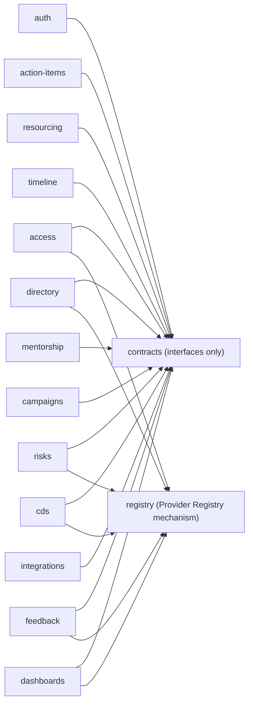
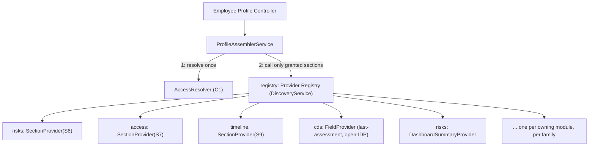
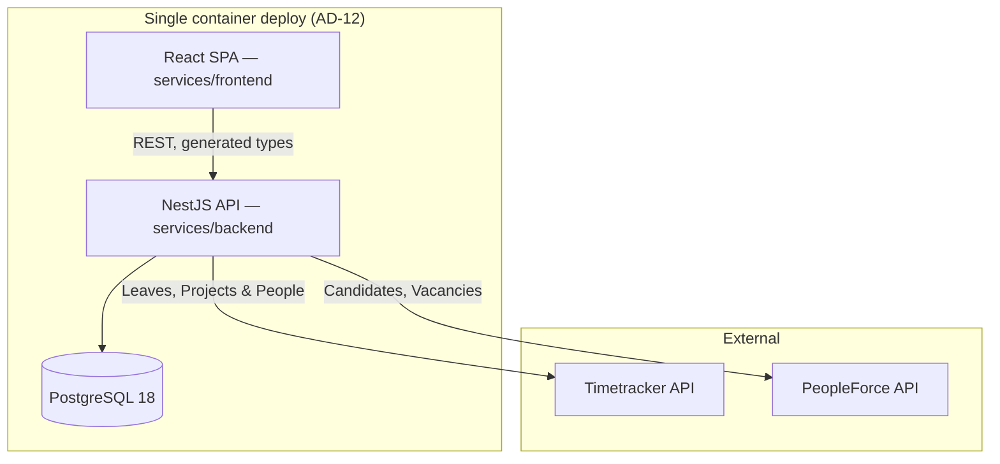
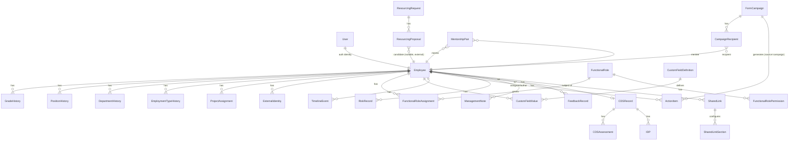

# Architecture Spine — People Management Platform

## Design Paradigm

**Layered modules with a centralized, DI-abstracted access-resolution layer.** Each backend feature is a NestJS module (controller → service → Prisma), matching the existing `modules/<name>` convention in `services/backend`. What makes this system's paradigm non-generic is the cross-cutting concern every layer must obey: no profile-scoped or aggregate data crosses a controller boundary without having passed through `AccessResolver` first. That resolution is architected as its own layer (the `access` module) that every other feature module depends on, and a generic Provider Registry mechanism (AD-3) makes cross-module reads possible — for profile assembly, directory filtering, and dashboard aggregation alike — without inverting AD-1's dependency direction.

Frontend mirrors the same idea one layer up: `EXPERIENCE.md`'s rule that an inaccessible section is absent from the DOM, not hidden, is enforced by never fetching or rendering data the backend didn't already filter — the frontend has no independent access logic to keep in sync.

## Invariants & Rules

### AD-1 — Module dependency direction

- **Binds:** all backend modules
- **Prevents:** circular module dependencies; a feature module quietly depending on another feature module's internals instead of a stable contract; the rule eroding silently because nothing stops it compiling
- **Rule:** A feature module may depend only on `contracts` (interfaces/DTOs) and `registry` (the Provider Registry mechanism, AD-3). A feature module may **never** import another feature module directly — not through TypeScript imports, and not by querying another module's Prisma tables directly. Cross-module data needs are satisfied only through a `contracts`-declared interface, implemented by the owning module and consumed via `registry` or direct DI token. This is enforced in CI, not just by convention: a `dependency-cruiser` rule forbidding `modules/<a>/**` from importing `modules/<b>/**` (except `contracts`, `registry`) runs on every PR.



### AD-2 — Contracts module holds interfaces only

- **Binds:** `contracts`, and every module implementing C1–C8 or a registry provider
- **Prevents:** the contracts module becoming a dumping ground for shared logic (which would silently reintroduce feature-to-feature coupling through a back door); two implementers of the same contract diverging on a field the contract left unspecified
- **Rule:** `contracts` exports TypeScript abstract classes / injection tokens and DTO shapes only — zero business logic, zero Prisma imports. Each owning module (per `interface-contracts.md`'s ownership, extended below) provides the concrete implementation, bound to its token in its own module's providers array. A Wave-0/1 stub provider (fixed/permissive return) can be swapped in for any token before the real implementation lands, with zero change to consumers. Every DTO type crossing an HTTP boundary must be plain-JSON-serializable (`Record`/array/primitive) — a type usable only in-process (e.g. `Map`) must be converted at the module boundary before any controller returns it; this is the general form AD-10 also depends on.

| Contract | Signature (ratified shape) | Token owner (implements) | Consumers |
| --- | --- | --- | --- |
| C1 `AccessResolver` | `resolveAudience(viewerId, subjectId) → { role, sections: Record<SectionId, "R"\|"RW"\|"none"> }` — `Record`, not `Map`, at any point this crosses an HTTP boundary (in-process composition may use a `Map` internally) | `access` | every module reading/writing profile-scoped data |
| C2 `FieldRegistry` | `defineField(...)`, `setValue(...)`, plus a uniform query interface over built-in/derived/custom fields | `directory` | `directory`, `dashboards`, `campaigns` (audience filters) |
| C3 `ProjectAssignment` | `{ employeeId, projectId, pmId, dmId, startDate, endDate, confirmed: boolean, confirmedAt: DateTime }` — `confirmed`/`confirmedAt` are part of the ratified shape (AD-8 depends on both, not just `confirmed`) | `access` (seed), `integrations` (real writer) | `access` (Manager-access resolution), `resourcing` (candidate project context) |
| C4 `TimelineEventWriter` | `recordTimelineEvent(employeeId, type, effectiveDate, oldValue, newValue, source, authorId?)` — `oldValue`/`newValue` are always the **raw typed value** for `type` (e.g. the grade enum value, an ISO date, a boolean), never a pre-formatted string; the timeline UI formats per `type` at render time, mirroring AD-6's "only the registry branches on type" discipline. `markSystemWriteSkipped(manualEventId, skippedAt)` — attaches skip metadata to an **existing manual** `TimelineEvent` (per `EXPERIENCE.md`'s Career Timeline affordance); never creates a separate timeline row for the skip itself | `timeline` | `access`, `mentorship`, `integrations` |
| C5 `ExternalIdentityMapping` | `{ system, externalId, employeeId, supersededBy? }` | `integrations` | `integrations`, `resourcing` |
| C6 `ActionItemCreation` | `createActionItem({ assigneeId, authorId, title, description?, dueDate, link?, source, campaignId? }) → ActionItem` | `action-items` | `campaigns` |
| C7 `CurrentUserProvider` *(new — closes a real gap: every controller needs the authenticated viewer's id, and AD-1 forbids importing `auth` directly)* | `getCurrentUser(request) → { userId }` — a request-scoped provider/decorator (`@CurrentUser()`), not a service method any module calls manually | `auth` | every controller that calls C1, directly or via `registry` |
| C8 `PermissionChecker` *(new — closes a real gap: functional-role/feature-permission checks, `access-model.md` §2.2–2.3, have no contract today)* | `hasPermission(userId, permissionKey) → boolean` | `access` | `resourcing`, `campaigns`, `cds`, `mentorship`, `directory` — anywhere a feature gate (not a data-visibility gate) is needed. No module queries `FunctionalRoleAssignment`/`FunctionalRolePermission` directly — mirrors AD-6's single-branch-point discipline. |

### AD-3 — Provider Registry (cross-module reads without cross-module imports)

- **Binds:** CAP-1 (profile assembly), CAP-2 (Directory's derived/filterable fields, FR-34), CAP-12 (Dashboards, FR-47–51), and every module that owns data one of those three needs to read
- **Prevents:** `access`/`directory`/`dashboards` needing a direct import of every other feature module (which AD-1 forbids); a data-owning module forgetting to gate its own data behind `AccessResolver`; ambiguity over what a missing or colliding registration does at runtime
- **Mechanism:** NestJS has no built-in multi-provider merge across modules (this is not Angular). The registry is a small `registry` module using `@nestjs/core`'s `DiscoveryService` + `Reflector`: any injectable class decorated `@RegisterProvider(family, id)` (families: `section`, `field`, `dashboard-summary`) is discovered at application bootstrap and indexed by `(family, id)`. `registry` depends only on `@nestjs/core` — never on any feature module — so any feature module may safely depend on `registry` without violating AD-1.
- **Rule:**
  - Three provider families, one shared mechanism: `SectionProvider.getSection(viewerId, employeeId): SectionDto` (profile assembly, one per S1–S16-owning module), `FieldProvider.getFilterableFields(): FieldSpec[]` + resolver (Directory's CDS-derived filters, e.g. FR-34's last-assessment-date/open-IDP), `DashboardSummaryProvider.getSummary(viewerScope): SummaryDto` (Dashboards' per-source aggregates: risk counts, leave status, resourcing counts). `risks`' `SectionDto`/`SummaryDto` both include a precomputed `trend: "up" | "down" | "flat"` field — diffed against the previous `RiskRecord` once, backend-side — so Profile, All Employees, and Risk Dashboard render the identical value instead of three independent frontend implementations of the same diff (per `DESIGN.md`'s Trend Arrow).
  - `null` is reserved for "not authorized / not applicable" — a state `ProfileAssemblerService` should never actually observe, since AD-5 means it only calls a provider for a section already granted. "Authorized, no records yet" is **always** a present, empty-shaped DTO, never `null`.
  - Registration collision (two providers for the same `(family, id)`) is a **bootstrap-time failure**, not a silent last-wins/first-wins. A section/field/summary that should have a provider but doesn't is a **runtime error at first call**, rendered to the frontend as an explicit "temporarily unavailable" state — never a silent omission indistinguishable from "not granted" (a genuine data-leak-shaped bug per `access-model.md` Rule 1's own framing).
  - `ProfileAssemblerService` (in `access`) resolves the viewer's audience **once** per request via C1, then calls `SectionProvider.getSection` **only** for sections the resolved role grants.



### AD-4 — Access resolution is per-request; caching is generation-gated or absent

- **Binds:** CAP-1, all `AccessResolver` consumers
- **Prevents:** a stale permission cache becoming a data leak (SPEC constraint, `decisions.md` D1)
- **Rule:** `AccessResolver.resolveAudience()` is called fresh on every request by default — no caching in v1. If profiling under NFR.2 (500+ records, 2s target) shows this is a bottleneck, the **only** acceptable cache shape is D1's: a per-subject cache invalidated synchronously by a monotonically increasing generation counter on the relationship graph (reports-to, project assignment, PP assignment). The counter must bump on **any** write to a `ProjectAssignment` row — including a `confirmed`/`confirmedAt` flip on an existing row (AD-8), not only row create/delete — so a future cache can never race AD-8's outage-handling. This AD does not implement the cache — it forbids implementing any *other* kind, and pins this specific gap shut in advance.

### AD-5 — Colleague whitelist is a resolved role, not a filter

- **Binds:** CAP-1, CAP-2 (Colleague mode of the directory)
- **Prevents:** a developer implementing "Colleague" by taking the full profile response and stripping fields client-side or in a post-processing step
- **Rule:** `AccessResolver` resolves Colleague to a **fixed section-grant map** (S1, S10, S11 only) identical to any other resolved role — `ProfileAssemblerService` (AD-3) never sees a code path that says "assemble everything, then trim." The whitelist is data the resolver returns, not logic the frontend or a serializer applies. The same discipline governs Shared Link creation: S3/S7/S13 are **structurally excluded** server-side (the `access` module's link-creation validation rejects them outright, regardless of what a client submits) — never merely omitted from a frontend checkbox list, which would be exactly the client-side-only filtering this AD forbids.

### AD-6 — Custom fields: typed-value table, not column-per-field

- **Binds:** CAP-2 (`FieldRegistry`, C2)
- **Prevents:** a schema migration on every HR-Admin-created field (SPEC constraint, PRD FR-8); two developers disagreeing on what an unset value or a missing row means
- **Rule:** One `CustomFieldValue` table: `(employeeId, fieldDefinitionId, valueText, valueNumber, valueDate, valueBoolean, valueSelect)` — one column populated per row, typed by `CustomFieldDefinition.type`; every unused column is SQL `NULL`, **never** a typed sentinel (`''`, `0`, `false`). A `CustomFieldValue` row exists **only** once a value is actually set (lazy creation) — a missing row, not a present all-`NULL` row, is the sole representation of "unset." Filtering/sorting queries branch on `CustomFieldDefinition.type` to pick the populated column; a partial index per commonly-filtered field is a query-time optimization, not a schema change. `FieldRegistry`'s query interface (C2) is the **only** place that branches on field type — no consumer (directory, dashboards, campaigns) special-cases custom vs. built-in fields.

### AD-7 — Temporal fields are effective-dated history tables

- **Binds:** CAP-1 (S4 Employment), CAP-7 (Career Timeline), PRD §1 Process and Data Guardrails
- **Prevents:** grade/position/department/employment-type modeled as a scalar column plus a bolted-on audit log (PRD constraint, explicit); a history-table write landing without its paired timeline event (or vice versa)
- **Rule:** One history table per dimension — `GradeHistory`, `PositionHistory`, `DepartmentHistory`, `EmploymentTypeHistory` — each `(employeeId, value, effectiveFrom, effectiveTo)`, `effectiveTo IS NULL` = current. The current-value read is `WHERE effectiveTo IS NULL`, never a denormalized "current" column that could drift from the history. The coupling to `TimelineEventWriter` (C4) is structural, not a convention to remember: a Prisma Client Extension (`$extends`) on the four history tables' `create`/`update` operations calls C4 automatically — no service method writes to a history table through any other path. When that extension detects the incoming system-sourced write would overwrite a manual `TimelineEvent` covering the same effective window (`decisions.md` D2), it suppresses the history write and calls C4's `markSystemWriteSkipped(manualEventId, skippedAt)` to attach skip metadata to the **existing manual entry** — never a silent no-op, and never a separate timeline row; `EXPERIENCE.md`'s "A system update was skipped here — {date}" affordance renders on that manual entry by querying the annotation C4 wrote.

### AD-8 — Timetracker confidence state gates access, never display alone

- **Binds:** CAP-13, CAP-1 (`ProjectAssignment`, C3)
- **Prevents:** a sync outage silently granting stale Manager access (`decisions.md` D3, PRD FR-53), including the case where a person rolls off a project *during* a prolonged outage
- **Rule:** `ProjectAssignment` rows carry `confirmed: boolean` **and** `confirmedAt: DateTime` (both part of C3's ratified shape, AD-2), written by `integrations` on every successful sync pass — not just on first creation. `AccessResolver`'s project-assignment leg grants Manager access only from rows where `confirmed = true` **and** `confirmedAt` is within a bounded freshness window (default: the sync's own expected interval × 2 — a config value, not hardcoded). This closes the sticky-flag gap: a row that was confirmed before an outage began ages out of the freshness window during a prolonged outage and stops granting access, rather than granting it indefinitely on stale-but-once-true data. Display-layer "temporarily unavailable" (S10/S11) is a **separate**, frontend-visible sync-freshness flag — implementing one must never touch the other's code path.

### AD-9 — Auth is a distinct concern from access-role resolution

- **Binds:** `auth`, `access`
- **Prevents:** authentication logic and access-role logic becoming entangled, which would make a future SSO swap touch the access model
- **Rule:** `auth` answers only "who is this session" (JWT, local email/password) and produces a `userId`, exposed to every other module exclusively through C7 `CurrentUserProvider` (AD-2) — never through a direct import of `auth`'s guards/services. `access` (`AccessResolver`, C1) answers "what can this `userId` see about subject X" from relationship data alone. `auth` has zero knowledge of sections, roles, or the access matrix; `access` has zero knowledge of how the session was established.

### AD-10 — API contract is generated, not hand-written, on the frontend

- **Binds:** frontend `api/` layer, all backend controllers
- **Prevents:** frontend/backend type drift; a frontend track blocked on a backend endpoint actually existing before building against its shape
- **Rule:** Every backend controller carries complete `@nestjs/swagger` decorators (already the established pattern, see `modules/users`), and every response DTO is already HTTP-safe per AD-2's serializability rule. Frontend types are generated from `/api/docs-json` via `openapi-typescript` into a committed, regenerable file — never hand-authored parallel interfaces. CI regenerates the file and diffs against the committed version, failing the build on drift. A track can freeze a controller's DTO shape and decorators in Wave 0/1 and generate against it before the service logic is real.

### AD-11 — Frontend surfaces map 1:1 to EXPERIENCE.md's IA, not to backend modules

- **Binds:** frontend `pages/`
- **Prevents:** the frontend's page structure drifting from the UX spine's information architecture, or being reorganized around backend module boundaries instead; backend modules acquiring unratified peer-to-peer calls in place of frontend orchestration
- **Rule:** One `pages/<Surface>/` folder per `EXPERIENCE.md` IA row (Dashboard, AllEmployees, EmployeeProfile, MyProfile, Resourcing, RiskDashboard, Campaigns, MentorshipHub, AdminRoles, AdminFields; SharedLinkView as an authenticated route — per `EXPERIENCE.md`'s Foundation, Shared Link consumption still requires a session, additionally scoped by validating the link token server-side against `SharedLink`/`SharedLinkSection` — reached via direct URL rather than nav, not a public unauthenticated shell). A page folder may call several backend modules' generated API hooks — the frontend's organizing axis is the user-facing surface, the backend's is the domain. Where a PRD flow spans two capabilities with no contract between their owning modules (e.g. FR-46's "request feedback" creating a Form Campaign; CAP-6's candidate review triggering a Shared Link), the frontend orchestrates the two calls in sequence from the initiating page — `feedback` and `resourcing` never call `campaigns`/`access` directly, and `campaigns`/`access` never call back into the initiator.

### AD-12 — Deployment & environments

- **Binds:** all modules, operational envelope
- **Prevents:** "deployed and demonstrable, not on someone's laptop" (PRD success signal) being left to each developer's own ad hoc setup
- **Rule:** Single containerized deployment — `docker-compose` (already used locally for Postgres) extended to three services: `backend`, `frontend` (built static assets served by a lightweight server, or Vite preview), `postgres`, on one host or a simple container platform. One environment (`production`) for this iteration; no staging tier. Secrets (`DATABASE_URL`, `JWT_SECRET`, `TIMETRACKER_API_KEY`, `PEOPLEFORCE_API_KEY`) via environment variables, validated by the existing Joi schema, never committed.

### AD-13 — Test architecture

- **Binds:** all modules; directly implements SPEC's primary success metric (SM-1) and PRD §1's foundation-phase requirement
- **Prevents:** the access-matrix test suite (SM-1's whole substance) being built ad hoc per developer, per module, with inconsistent coverage
- **Rule:** Jest, matching the existing convention (`src/modules/*/__tests__/`, `test/` for e2e — both already established). Every `SectionProvider`/`FieldProvider`/`DashboardSummaryProvider` implementation ships a parameterized access-matrix test (see Consistency Conventions) as part of its own module's `__tests__/`, not a separate cross-cutting test module — the test lives next to the code it verifies, same discipline as the rest of the codebase. `AccessResolver` itself (in `access`) carries the master parameterized suite driven directly off `access-model.md`'s table. e2e tests (Playwright, existing frontend convention) cover full request/response cycles for the negative cases explicitly required by PRD §9's Definition of Done — every `—` cell, every flag-gated record against both gated audiences, the Colleague whitelist.

## Consistency Conventions

| Concern | Convention |
| --- | --- |
| Naming (entities, files, interfaces) | Backend: `modules/<kebab-name>`, one Nest module per row in AD-2's table; Prisma models PascalCase singular (`Employee`, `RiskRecord`), mapped to snake_case tables via `@@map` (existing convention, e.g. `User` → `@@map("users")`). DTOs suffixed `Dto`. Frontend: `pages/<PascalCaseSurface>/`, component folders per existing `react-components.md` rule. |
| Data & formats (ids, dates, error shapes) | IDs: UUID (matches existing `User.id`). Dates: ISO 8601 over the wire, `DateTime` in Postgres. Errors: Nest's built-in `HttpException` hierarchy + a global exception filter producing one JSON envelope `{ statusCode, message, error }` — no module invents its own error shape. |
| State & cross-cutting | Controllers never call Prisma directly — always through the module's service. **Two separate axes** (`access-model.md` §2.2–2.3): C1 `AccessResolver` gates **section visibility** during profile assembly (`ProfileAssemblerService`), directory filtering, and any read path that must obey the section matrix (AD-3/AD-4/AD-5/AD-8). C8 `PermissionChecker` gates **functional features** (resourcing, campaigns, CDS maintenance, mentorship assignment, custom-field admin) — never conflated with section visibility and never invoked from `ProfileAssemblerService` or the `registry` layer. Neither is re-implemented per module. Config via `@nestjs/config` + Joi (existing pattern), including `TIMETRACKER_API_KEY`/`PEOPLEFORCE_API_KEY` and the sync-freshness-window value (AD-8). Structured logging via Nest's built-in `Logger`, one logger per service class. |
| Frontend server state | TanStack Query exclusively for server data (existing pattern) — no duplicate client-side cache of the same data in Context/Zustand. `LayoutContext` (existing) remains the only cross-cutting **UI** state; no new global state library introduced. |
| Frontend copy | `react-i18next` (existing pattern) — every new string is a translation key, never hardcoded, matching `EXPERIENCE.md`'s Foundation and the existing `CLAUDE.md` code-style rule. |
| Non-production data | Seed/dev/test data is generated pseudonymized (real structure/volume, substituted names/contacts) by a dedicated seed script (`prisma/seed.ts`, SPEC NFR.3) — never a dump or copy of production data. Enforced by having no tooling path that reads production Postgres from a non-production environment (AD-12 — single deploy target today, so this is a config/access-control discipline, not a network-topology one yet). |
| Access-matrix test convention | One parameterized test suite per section (S1–S16), iterating every audience row of `access-model.md`'s matrix as a table-driven case — asserting the exact `R`/`RW`/`none` outcome per (audience, section) pair, plus an explicit negative case for every `—` cell. Generated/maintained alongside `access-model.md` so the two never drift; this is what SM-1 (the SPEC's primary success metric) is actually built against, not an afterthought layered on at QA time. |

## Stack

| Name | Version |
| --- | --- |
| NestJS | 11 (existing) |
| Prisma | 7, `@prisma/adapter-pg` (existing) |
| PostgreSQL | 18 (existing, docker-compose) |
| Node.js | 22 (existing — project's own `engines` constraint; Prisma 7's own floor is 18.18, 22 is this project's pin, not Prisma's requirement) |
| React | 19 (existing) |
| Vite | 8 (existing) |
| shadcn/ui (`style: radix-nova`, per the repo's own `components.json`) + Tailwind | v4 (existing) |
| React Router | v7 (existing) |
| TanStack Query | v5 (existing) |
| openapi-typescript | 7.13.0 — new, for AD-10 |
| @nestjs/jwt | 11.0.2 — new, for AD-9 |
| @nestjs/passport | 11.0.5 — new, for AD-9 |
| passport-jwt | 4.0.1 — new, for AD-9. Flagged maintenance-inactive upstream (~4 years since last publish) but still the correct pin (nothing newer exists) and widely depended-on; accepted as a low-churn, stable dependency for a JWT-verification strategy, not a currency risk. Revisit only if a concrete vulnerability surfaces. |
| react-hook-form | 7.85.0 — new, noted as not-yet-installed in frontend `CLAUDE.md`, needed for the first form surface (resourcing request, custom field definition, campaign creation) |
| zod | 4.4.3 — new, paired with react-hook-form |
| @hookform/resolvers | 5.9.1 — new, bridges react-hook-form + zod |
| dependency-cruiser | latest — new, for AD-1's CI-enforced module-boundary rule |

## Structural Seed





```text
services/backend/src/modules/
  contracts/        # C1-C8 abstract tokens + DTOs — interfaces only, AD-2
  registry/          # Provider Registry (DiscoveryService) — AD-3, no feature-module deps
  auth/              # JWT session, login, C7 CurrentUserProvider impl — AD-9
  access/            # C1 AccessResolver, C8 PermissionChecker, ProfileAssemblerService, functional roles, shared links — AD-1/3/4/5
  directory/         # C2 FieldRegistry, employee list, custom fields, saved views, export
  action-items/      # C6 impl
  risks/
  resourcing/
  timeline/          # C4 TimelineEventWriter impl
  cds/
  mentorship/
  campaigns/
  feedback/
  dashboards/        # DashboardSummaryProvider consumer, depends on contracts+registry only (AD-1/AD-3)
  integrations/      # C3 writer (confirmed/confirmedAt), C5 impl, timetracker + PeopleForce clients — AD-8

services/frontend/src/
  pages/             # one folder per EXPERIENCE.md IA surface — AD-11
  api/                # generated types (AD-10) + TanStack Query hooks, one subfolder per backend module
  components/         # existing shared-component convention, unchanged
```

## Capability → Architecture Map

| Capability | Lives in | Governed by |
| --- | --- | --- |
| CAP-1 Access Control, Roles & Profile | `access` | AD-1, AD-3, AD-4, AD-5, AD-9 |
| CAP-2 Directory & Custom Fields | `directory` | AD-2, AD-3 (FieldProvider), AD-6 |
| CAP-3 Self-Service | `access` (Self-scoped profile **read**); writes distributed to owning modules per action (`cds` for IDP self-complete, `action-items` for self-complete, `mentorship` for self-flag, `directory` for contact edits) | AD-3, AD-5, AD-11 |
| CAP-4 Action Items | `action-items` | AD-2 (C6) |
| CAP-5 Risks | `risks` | AD-1, AD-3 (Section + DashboardSummary providers) |
| CAP-6 Resourcing | `resourcing` | AD-1, AD-2 (C3, C5 consumer), AD-11 (Shared Link trigger is frontend-orchestrated) |
| CAP-7 Career Timeline | `timeline` | AD-2 (C4), AD-7 |
| CAP-8 CDS | `cds` | AD-1, AD-3 (Section + Field providers) |
| CAP-9 Mentorship | `mentorship` | AD-2 (C4 consumer) |
| CAP-10 Forms & Campaigns | `campaigns` | AD-2 (C2, C6 consumer), AD-11 (feedback-request trigger is frontend-orchestrated) |
| CAP-11 Feedback | `feedback` | AD-1, AD-3 (Section provider), AD-11 |
| CAP-12 Dashboards | `dashboards` | AD-1, AD-3 (DashboardSummary providers) |
| CAP-13 Integrations | `integrations` | AD-2 (C3, C5), AD-8 |

## Deferred

- **AccessResolver caching implementation** (AD-4 forbids the wrong shape but doesn't build the right one) — revisit only if NFR.2 performance testing shows a real bottleneck at 500+ records.
- **PeopleForce API specifics** (auth, endpoints, rate limits, webhooks, and the exact DTO shape `integrations` hands to `resourcing` once the live integration replaces the outbound-link fallback) — CAP-13's own investigation story (`decisions.md` D8); the fallback means nothing blocks on it today, but the candidate-review DTO shape should be frozen (via `contracts`) before both `integrations` and `resourcing` build against assumed shapes independently.
- **Notifications and Analytics** (PRD good-to-have, non-goals for MVP) — no architectural seed until they're back in scope.
- **Horizontal scaling / multi-instance deployment** — AD-12's single-container target doesn't need it; revisit if the deployment target changes.
- **CI/CD pipeline specifics** — AD-12 fixes the deployment target; the actual pipeline (GitHub Actions vs. other) is a delivery-tooling choice for Wave 0, not this spine.
- **Staging/multi-environment topology** — AD-12 scopes one environment for this iteration; a staging tier can be added without changing any AD here.
- **Exact permission-string vocabulary beyond the SPEC's minimum grantable set** — `FunctionalRolePermission` rows are data; the starting set is `access-model.md`'s named minimum, HR Admin extends it at runtime, no schema change either way.
- **MentorshipPair's `endedAt`/closing-feedback atomicity** — field-level detail below this altitude, flagged for the epics/stories pass: `endedAt` must only ever be set alongside the required closing-feedback text (FR-37), never independently, so the Status Badge (positive) treatment EXPERIENCE.md specifies never shows on a pair that's ended without feedback.
- **Freshness-window value for AD-8's `confirmedAt` check** — a config number, tunable once the real timetracker sync interval is known from `decisions.md` D8's investigation; the mechanism (not the value) is fixed now.
